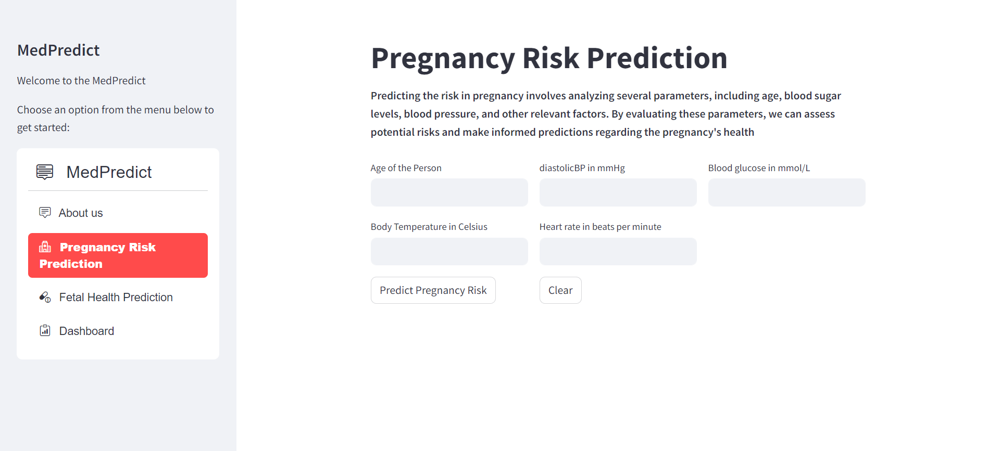
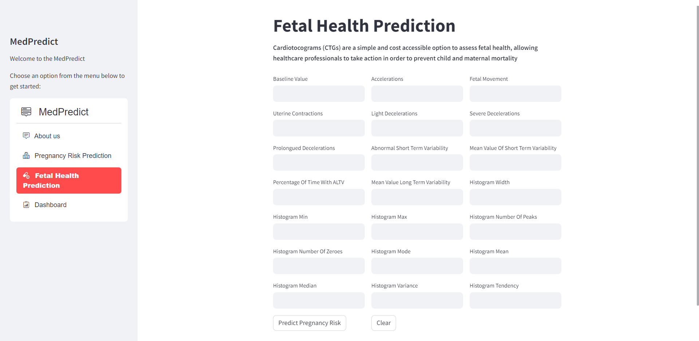

# MedInsight - Advanced Maternal and Foetal Health Prediction Platform

## Introduction

Welcome to MedInsight, an innovative platform dedicated to advancing maternal and foetal health through predictive analysis. MedInsight empowers healthcare professionals and users alike by providing accurate predictions and proactive risk management related to pregnancy.

### Webapp URL
MedInsight: [MedInsight link]()

### Datasets Used

**Dataset:** 
1. https://www.kaggle.com/datasets/csafrit2/maternal-health-risk-data
2. https://www.kaggle.com/datasets/andrewmvd/fetal-health-classification

## Key Features

- **Pregnancy Risk Prediction:** Our Pregnancy Risk Prediction feature utilizes advanced algorithms to analyze various parameters, including age, body sugar levels, blood pressure, and more. By processing this information, we provide accurate predictions of potential risks during pregnancy.

- **Fetal Health Prediction:** Cardiotocograms (CTGs) are a simple and cost accessible option to assess fetal health, allowing healthcare professionals to take action in order to prevent child and maternal mortality

- **Dashboard:** Our Dashboard provides a user-friendly interface for monitoring and managing health data. It offers a holistic view of predictive analyses, allowing healthcare professionals and users to make informed decisions. The Dashboard is designed for ease of use and accessibility.

<p align="center">
     

</p>

<p align="center">
     

</p>

## Frontend

The UI of the web app is made with Streamlit. It is a free and open-source framework to rapidly build and share beautiful machine learning and data science web apps. It is a Python-based library specifically designed for machine learning engineers.

### Install Dependencies
 ```bash
 pip install -r requirements.txt
 ```
 ### Run the Streamlit App
 ```bash
streamlit run main.py
```

